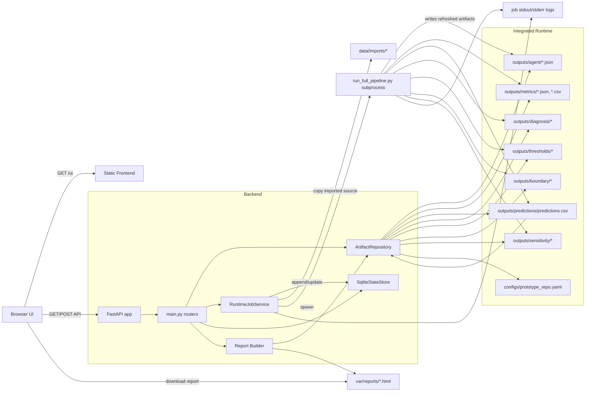
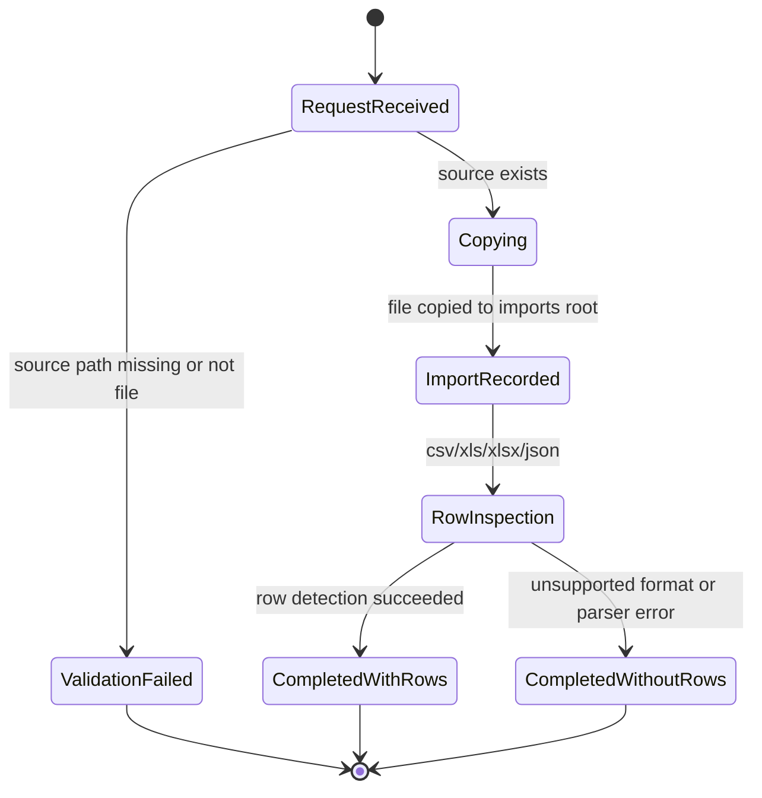
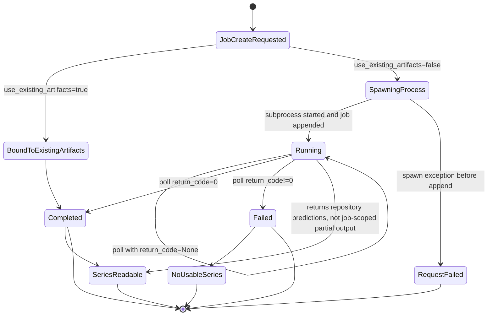
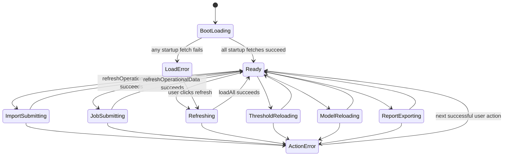

# 2026-06-05 Engineering Review

## Scope And Review Basis

This review applies the `/plan-eng-review` engineering dimensions to the current MVP implementation. The full interactive skill workflow is blocked in this host because `AskUserQuestion` is unavailable, so this document is the direct engineering review fallback.

Implementation basis:
- `backend/app/main.py`
- `backend/app/services/runtime_jobs.py`
- `backend/app/services/state_store.py`
- `backend/app/services/artifact_repository.py`
- `backend/app/services/report_builder.py`
- `frontend/js/main.js`
- `frontend/js/shared.js`
- `frontend/js/dashboard.js`
- `frontend/js/jobs.js`
- `frontend/js/analysis.js`

Guardrails preserved in this review:
- Current product scope is still the Wusongkou single-station, multimodal, daily-scale prototype.
- Threshold outputs are empirical retrieval artifacts, not calibrated 2D hydrodynamic physical thresholds.
- Boundary labels are raster-derived proxy labels.
- Scenario triage, playbook, Sobol, and counterfactual outputs are diagnostic support artifacts, not validated control policies.

## Current Architecture Snapshot

The current MVP is an integrated-runtime web application, not a dual-product bridge.

- The backend mounts a static frontend and exposes FastAPI endpoints for metadata, artifact-backed read views, import records, prediction job records, and report export.
- The algorithm core is the repository root runtime itself; repository reads operate directly on integrated WaterExpert outputs.
- SQLite-backed application state is persisted under `var/state/`, alongside job-scoped run directories and job logs.
- Runtime task execution is split into two paths:
  - `use_existing_artifacts=true`: bind a job record directly to already-integrated outputs.
  - `use_existing_artifacts=false`: spawn `run_full_pipeline.py` as a subprocess and later refresh status by polling the stored `Popen` handle.
- The frontend loads all major views on startup, then refreshes imports and jobs on demand after form submissions or manual refresh.

## Data Flow Diagram

## State Machines

### 1. Data Import Record State Machine

Current implementation note:
- There is no explicit `copy_failed` or `parse_failed` persisted state. Exceptions during copy are request-fatal, while row-detection failures silently degrade to `rows_detected = null`.

### 2. Prediction Job State Machine

Current implementation note:
- A process restart removes the in-memory `_processes[job_id]` handle, so persisted `running` jobs can become stranded with no later transition to `completed` or `failed`.

### 3. Frontend Page And Action State Machine

Current implementation note:
- There is no background polling state for `running` jobs. Job completion discovery depends on manual refresh or another explicit reload path.

## Edge Cases

### Import Flow

1. Source path exists, but the file is locked by another process during `copy2`; the request fails without writing a `failed` import record.
2. Source path exists, copy succeeds, but CSV/Excel/JSON parsing fails; the import is still marked `imported` with no row count, which hides parse health from the operator.
3. Re-importing the same source file creates multiple copied files and duplicate records because there is no deduplication fingerprint.
4. Very large files are copied and row-counted inline in the request thread, so import latency can block the API worker.
5. Unsupported file types are accepted as long as the file exists; the system records them as imported even if downstream algorithms cannot consume them.
6. `station_code` is recorded but not validated against the actual station registry or product scope.

### Prediction Job Semantics

7. `use_existing_artifacts=true` marks a job `completed` even if the selected date range, model name, or station code do not match the currently integrated artifacts.
8. `config_path` is stored and passed to the subprocess, but is not prevalidated for existence, readability, or compatibility before process launch.
9. A spawned process can continue running after the API service restarts, but the in-memory `_processes` map is lost; the persisted job may remain permanently `running`.
10. `get_job_series(job_id)` returns repository-level predictions for both `running` and `completed` jobs, so the series is not guaranteed to belong to that exact job execution.
11. Concurrent full-pipeline runs can overwrite the same shared `outputs/` tree, so later polling may attach the wrong artifact manifest to the wrong job.
12. Failed subprocess runs still attach the current artifact manifest on refresh, which can mislead operators into assuming new outputs were produced.

### Persistence And Concurrency

13. `JsonStateStore` uses only a process-local thread lock; multi-process or multi-worker deployment can race on the JSON files.
14. JSON files are rewritten wholesale on each append/update, so partial writes or process crashes can corrupt the entire store.
15. There is no schema migration or version stamp on `data_imports.json` and `prediction_jobs.json`; field drift can break readers silently.
16. UTF-8 BOM tolerance exists on read, but malformed JSON still hard-fails list operations without a recovery path.

### Artifact Repository And Read Models

17. Any missing integrated artifact raises directly from repository reads, so one absent output file can break multiple pages and endpoints.
18. `predictions()` assumes the selected model and split exist in the shared `predictions.csv`; newly requested runtime variants are invisible until outputs are written in exactly that schema.
19. Empty prediction subsets can still propagate to the frontend; chart rendering then computes `Math.min(...[])` or `Math.max(...[])` over invalid numeric sets.
20. Threshold feature filtering assumes stable `knowledge_graph.threshold_nodes[*].feature` semantics; schema drift will break the dropdown or produce empty but seemingly valid results.
21. Boundary preview only trims to `split == test`; if the file layout changes or `split` is absent with mixed records, the UI may show unintended rows.

### Report Export

22. Report export is a read-time snapshot over multiple artifact files; if a pipeline run mutates outputs during export, the HTML report can combine inconsistent versions of metrics, predictions, and diagnostics.
23. Reports are exported as HTML only; consumers expecting PDF/Word from the product spec can misread MVP completeness.
24. Repeated exports create new files but no index or retention control, so report storage can grow without operator visibility.

### Frontend Behavior

25. Initial page load is all-or-nothing at the Promise boundary for the startup batch; one failing endpoint prevents the entire page from entering the ready state.
26. There is no job-status polling or incremental refresh after job creation; a long-running pipeline looks stuck unless the user manually refreshes.
27. `renderPredictionChart()` assumes numeric series values; unexpected strings, null-heavy rows, or an empty filtered series can produce invalid SVG paths.
28. `thresholdOptions` are initialized once from the first loaded threshold graph and then reused; if later feature filters or schema changes alter the option universe, the UI can go stale.
29. `window.open()` report download behavior can be blocked by browser popup policy if not treated as a direct user gesture in some environments.

## Test Matrix

| Area | Scenario | Setup | Action | Expected Result | Level |
| --- | --- | --- | --- | --- | --- |
| Health | Integrated runtime ready | Valid repository-root runtime outputs | `GET /healthz` | `200` and `status=ok` | API smoke |
| Health | Missing required artifact | Rename `outputs/predictions/predictions.csv` | `GET /healthz` | `500` with missing asset detail | API negative |
| Meta | Guardrails exposed | Normal runtime | `GET /api/v1/meta` | Scope and guardrails present | API contract |
| Stations | Single-station metadata | Normal runtime | `GET /api/v1/stations` | One Wusongkou station profile returned | API contract |
| Import | Missing source file | Nonexistent local path | `POST /api/v1/data/import` | Record persisted with `status=failed` | API integration |
| Import | CSV happy path | Small valid CSV | `POST /api/v1/data/import` | File copied, `rows_detected` populated | API integration |
| Import | Excel happy path | Small valid XLSX | `POST /api/v1/data/import` | File copied, `rows_detected` populated | API integration |
| Import | Locked file | Source file opened with exclusive lock | `POST /api/v1/data/import` | Request fails predictably; no silent partial record | Failure injection |
| Import | Unsupported format | Valid `.txt` file | `POST /api/v1/data/import` | Current behavior captured: imported without row count | Regression |
| Import | Duplicate source | Same file imported twice | Two `POST` calls | Two distinct records and copied files | Regression |
| Jobs | Existing-artifact bind | Runtime outputs present | `POST /api/v1/prediction-jobs` with `use_existing_artifacts=true` | Immediate `completed` job with manifest | API integration |
| Jobs | Full pipeline spawn | Valid config path and script | `POST /api/v1/prediction-jobs` with `use_existing_artifacts=false` | `running` job with pid and log paths | API integration |
| Jobs | Invalid config path | Nonexistent config path | Spawn full pipeline job | Request behavior documented; downstream failure visible in logs/status | Failure injection |
| Jobs | Poll running job | Long-running stub pipeline | `GET /api/v1/prediction-jobs/{id}` before exit | Status remains `running`, log preview updates | API integration |
| Jobs | Poll completed job | Stub pipeline exits `0` | `GET /api/v1/prediction-jobs/{id}` after exit | Status becomes `completed`, `finished_at` set | API integration |
| Jobs | Poll failed job | Stub pipeline exits non-zero | `GET /api/v1/prediction-jobs/{id}` after exit | Status becomes `failed`, `return_code` set | API integration |
| Jobs | Restart during run | Start pipeline, restart API process | Requery same job id | Exposes stranded-running behavior clearly | Resilience |
| Job Series | Completed job series | Completed job exists | `GET /api/v1/prediction-jobs/{id}/series` | Prediction payload returned | API integration |
| Job Series | Failed job series | Failed job exists | `GET /api/v1/prediction-jobs/{id}/series` | `409` no usable output | API negative |
| Job Series | Running job series semantic drift | Running job with shared outputs | `GET /api/v1/prediction-jobs/{id}/series` | Current behavior documented: shared repository series returned | Semantics regression |
| Predictions | Default model load | Normal runtime | `GET /api/v1/predictions?split=test` | Best model auto-selected | API contract |
| Predictions | Unsupported model | Unknown model id | `GET /api/v1/predictions` | `400` unsupported model | API negative |
| Predictions | Empty subset | Remove all rows for chosen model/split | Load predictions | Backend returns empty `series`; frontend handles gracefully | API + UI |
| Diagnostics | Diagnosis files present | Normal runtime | `GET /api/v1/diagnostics` | Factor/process/domain payloads returned | API contract |
| Triage | Scenario payload present | Normal runtime | `GET /api/v1/scenario-triage` | Counts and high-priority days returned | API contract |
| Thresholds | All features | Normal runtime | `GET /api/v1/thresholds` | Summary, by-context, KG all returned | API contract |
| Thresholds | Filtered feature | Valid feature id | `GET /api/v1/thresholds?feature=...` | Both table and KG nodes filtered consistently | API integration |
| Thresholds | Unknown feature | Invalid feature id | `GET /api/v1/thresholds?feature=...` | Empty but structurally valid payload | API negative |
| Boundary | Proxy-label disclosure | Normal runtime | `GET /api/v1/boundary` | Label-generation summary and preview returned | API contract |
| Sensitivity | Sobol and counterfactual | Normal runtime | `GET /api/v1/sensitivity` | Both single and joint counterfactual slices returned | API contract |
| Report | Export happy path | Normal runtime | `POST /api/v1/report/export` | HTML report written and downloadable | API integration |
| Report | Export during mutation | Run export while pipeline updates outputs | `POST /api/v1/report/export` | Inconsistency risk surfaced or prevented by future fix | Failure injection |
| Frontend Boot | Full page happy path | Backend healthy | Load `/ui/index.html` | All sections render and banner shows success | UI smoke |
| Frontend Boot | One startup endpoint fails | Force `/api/v1/boundary` failure | Load page | Error banner shown; no uncaught crash | UI resilience |
| Frontend Jobs | No polling behavior | Create long job | Wait without refresh | UI remains stale until refresh; current limitation documented | UX regression |
| Frontend Model Switch | Valid model change | Normal runtime | Change `#modelSelect` | Chart and summary rerender | UI integration |
| Frontend Threshold Switch | Valid feature filter | Normal runtime | Change `#thresholdSelect` | Table and semantics rerender | UI integration |
| Frontend Report Download | Popup restricted browser | Browser popup blocking enabled | Click export | Failure mode understood; user still sees banner/report path | UX resilience |
| Persistence | Concurrent append/update | Parallel writes from multiple processes | Stress writes on JSON store | Detect corruption or lost update risk | Concurrency |
| Persistence | Malformed JSON store | Manually corrupt `prediction_jobs.json` | List jobs | Failure is explicit; recovery procedure needed | Failure injection |

## Highest-Risk Gaps

1. Job identity is not coupled to artifact identity. Shared `outputs/` reads mean a job record does not guarantee job-specific predictions, diagnostics, or reports.
2. Process lifecycle is not recoverable across API restarts. Persisted `running` jobs can become orphaned because only the JSON record survives, not the executable handle.
3. State persistence is not safe for multi-worker deployment. Whole-file JSON rewrites plus only in-process locking create a real corruption risk.
4. Frontend operational awareness is weak for long tasks and partial failures. Operators must manually refresh and cannot distinguish stale results from live progress.

## Recommended Next Fix Order

1. Introduce job-scoped artifact snapshots or run directories so each prediction job resolves to its own outputs.
2. Replace JSON-file state with a transactional store, or at minimum add atomic writes and cross-process locking.
3. Add restart-safe job reconciliation: persisted pid/state probing, timeout handling, and explicit `orphaned` status.
4. Add frontend polling for running jobs plus degraded rendering paths for empty or malformed series.
5. Separate import record states into `copied`, `parsed`, `failed`, and `unsupported` so data intake quality is observable.
